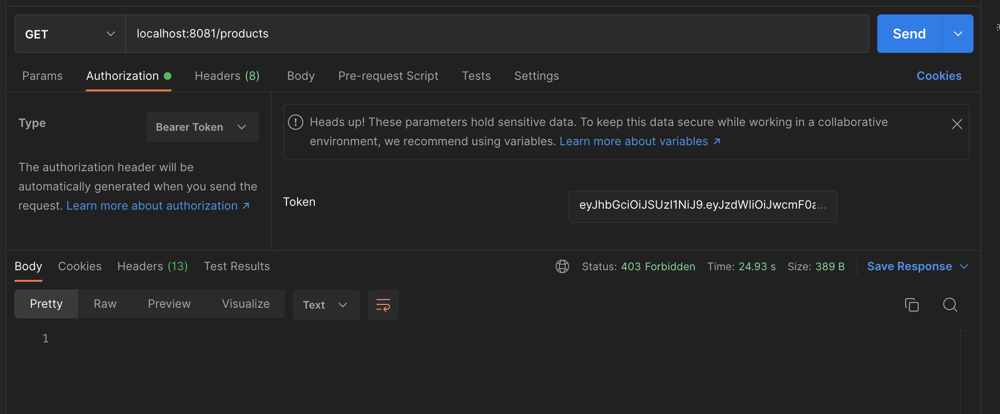
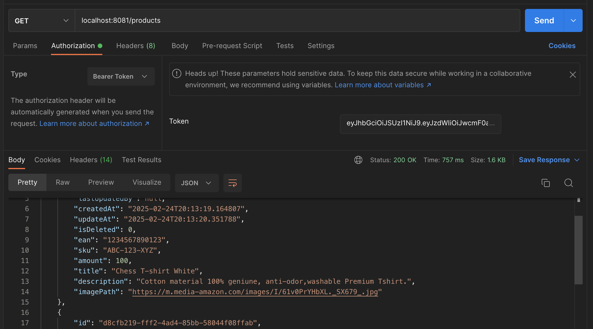
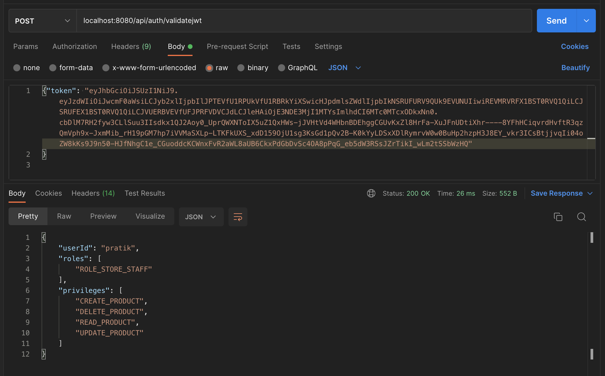

# JWT Authentication and Authorization Using RSA Private and Public key Spring boot 3.4.3 #

### Private Key: Used to sign the token, creating a secure and tamper-proof signature. ###
### Public Key: Used to verify the signature, ensuring that the token has not been altered and that it was indeed signed by the holder of the private key. ###
### This setup ensures a high level of security and trust, as only the holder of the private key can generate valid tokens, and anyone can use the public key to verify their validity. ###

### Generate RSA private and Public key using below command ###
```bash
openssl genrsa -out test_key.pem 2048
openssl rsa -in test_key.pem -outform PEM -pubout -out test_key.pem.pub
```
### Convert RSA private key into PKCS#8 format ###
```bash
openssl pkcs8 -topk8 -nocrypt -in test_key.pem -out test_key1.pem
```

### Using org.bouncycastle dependency to read RSA public and private key using PemReader ###

### Dependency
```groovy
implementation group: 'org.bouncycastle', name: 'bcprov-jdk18on', version: '1.80'
```

### LoadPrivate key using PemReader ###
```java
private static PrivateKey loadPrivateKey(String filePath) {
        try {
            Resource resource = new ClassPathResource(filePath);
            PemReader reader = new PemReader(new FileReader(resource.getFile()));
            PemObject pemObject = reader.readPemObject();
            byte[] content = pemObject.getContent();
            KeyFactory keyFactory = KeyFactory.getInstance(Constants.RSA_ALGORITHM);
            return keyFactory.generatePrivate(new PKCS8EncodedKeySpec(content));
        } catch (IOException | NoSuchAlgorithmException | InvalidKeySpecException exception) {
            LOGGER.error("Error occurred while loading private key {}", exception.getMessage());
        }
        return null;
    }
```
### Use Privatekey to sign the JWT token ###
```java
public String generateToken(AuthenticatedUserDto authentication){
    String username = authentication.getUserId();
    Date currentDate = new Date();
    Date expireDate = new Date(currentDate.getTime() + getJwtExpiration());

        return Jwts.builder()
                .subject(username)
                .claim(Constants.PRIVILEGE,authentication.getPrivileges())
                .claim(Constants.ROLE,authentication.getRoles())
                .issuedAt(new Date())
                .expiration(expireDate)
                .signWith(loadPrivateKey(getPrivateKeyFilePath()))
                .compact();

    }
```

### LoadPublic key ###
```java
private static PublicKey loadPublicKey(String filePath){
    try {
        Resource resource = new ClassPathResource(filePath);
        PemReader reader = new PemReader(new FileReader(resource.getFile()));
        PemObject pemObject = reader.readPemObject();
        byte[] content = pemObject.getContent();
        KeyFactory keyFactory = KeyFactory.getInstance(Constants.RSA_ALGORITHM);
        return keyFactory.generatePublic(new X509EncodedKeySpec(content));
    } catch (IOException | NoSuchAlgorithmException | InvalidKeySpecException exception) {
        LOGGER.error("Error occurred while loading public key {}", exception.getMessage());
    }
    return null;
}
```
### Use Publickey to verify Jwt ###
```java
public Claims extractClaims(String token){
    JwtParser parser = Jwts.parser()
            .verifyWith(loadPublicKey(getPublicKeyFilePath()))
            .build();
    return parser.parseSignedClaims(token).getPayload();
}
```

### Write a CustomPermissionEvaluator for custom privileges and roles according to your needs ###
```java
@Component
public class CustomPermissionEvaluator implements PermissionEvaluator {

    @Override
    public boolean hasPermission(Authentication authentication, Object targetDomainObject, Object permission) {
        if ((authentication == null) || (targetDomainObject == null) || !(permission instanceof String)) {
            return false;
        }
        String targetType = targetDomainObject.toString().toUpperCase();
        return hasPrivilege(authentication, targetType, permission.toString().toUpperCase());
    }

    private boolean hasPrivilege(Authentication auth, String targetType, String permission) {
        for (GrantedAuthority grantedAuth : auth.getAuthorities()) {
            if (grantedAuth.getAuthority().contains(targetType)) {
                if (grantedAuth.getAuthority().contains(permission)) {
                    return true;
                }
            }
        }
        return false;
    }
}
```

### Write PermissionEvaluatorConfiguration ###
```java
@Configuration
@EnableMethodSecurity
class PermissionEvaluatorConfiguration {

	@Bean
	static MethodSecurityExpressionHandler expressionHandler(CustomPermissionEvaluator customPermissionEvaluator) {
		// create a new DefaultMethodSecurityExpressionHandler
		// that will utilize CustomPermissionEvaluator
		DefaultMethodSecurityExpressionHandler handler = new DefaultMethodSecurityExpressionHandler();
		// add the PermissionEvaluator
		handler.setPermissionEvaluator(customPermissionEvaluator);
		return handler;
	}

}
```
### Add Security configuration 
```java
@Bean
public SecurityFilterChain securityFilterChain(HttpSecurity http) throws Exception {
    http.csrf(AbstractHttpConfigurer::disable)
            .cors(corsConfigurationSource -> corsConfigurationSource.configurationSource(corsConfigurationSource()))
            .authenticationProvider(authenticationProvider)
            .authorizeHttpRequests(request -> request.requestMatchers("/product").authenticated())
            .authorizeHttpRequests(request -> request.requestMatchers("/product/**").authenticated())
            .authorizeHttpRequests(request -> request.requestMatchers("/products").authenticated())
            .sessionManagement(httpSecuritySessionManagementConfigurer -> httpSecuritySessionManagementConfigurer.sessionCreationPolicy(SessionCreationPolicy.STATELESS))
            .addFilterBefore(jwtAuthenticationFilter, UsernamePasswordAuthenticationFilter.class);
    return http.build();
}
```

### Product Service Calls Authentication Service to make sure that the user has necessary roles and privileges ###
### Inorder to achieve this make sure to include roles and privileges in the JWT token when the user logs in. ###
```java
public String generateToken(AuthenticatedUserDto authentication){
    String username = authentication.getUserId();
    Date currentDate = new Date();
    Date expireDate = new Date(currentDate.getTime() + getJwtExpiration());

        return Jwts.builder()
                .subject(username)
                .claim(Constants.PRIVILEGE,authentication.getPrivileges())
                .claim(Constants.ROLE,authentication.getRoles())
                .issuedAt(new Date())
                .expiration(expireDate)
                .signWith(loadPrivateKey(getPrivateKeyFilePath()))
                .compact();

    }
```
### Validate the JWT token in each service that needs to authenticate and authorize requests. ###
### Extract roles and permissions from the JWT token for the current user. ###
### Use @PreAuthorize or other Spring Security annotations to restrict access to methods based on roles and permissions. ###
```java
@RestController
public class ProductController {

    @Autowired
    ProductService productService;

    @PreAuthorize("hasPermission('PRODUCT','READ')")
    @GetMapping("/products")
    public List<Product> getAllProducts(){
        return productService.getAllProducts(0,"updatedBy");
    }
    
    @PreAuthorize("hasPermission('PRODUCT','CREATE')")
    @PostMapping("/product")
    public Product createProduct(@RequestBody Product product){
        return productService.createProduct(product);
    }
    
    @PreAuthorize("hasPermission('PRODUCT','READ')")
    @GetMapping("/product/{id}")
    public Product getProductById(@PathVariable("id") String id){
        return productService.getProduct(id);
    }
}
```
### When user do not have enough privileges ###


### When user has privileges ###


### Send roles and privileges in response on validating JWT from Auth Service ###



